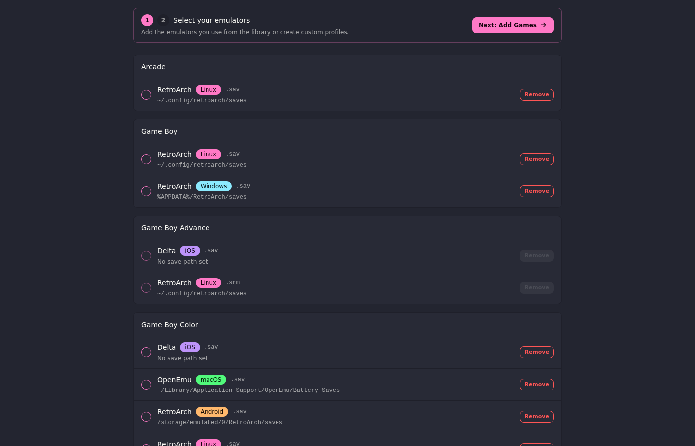
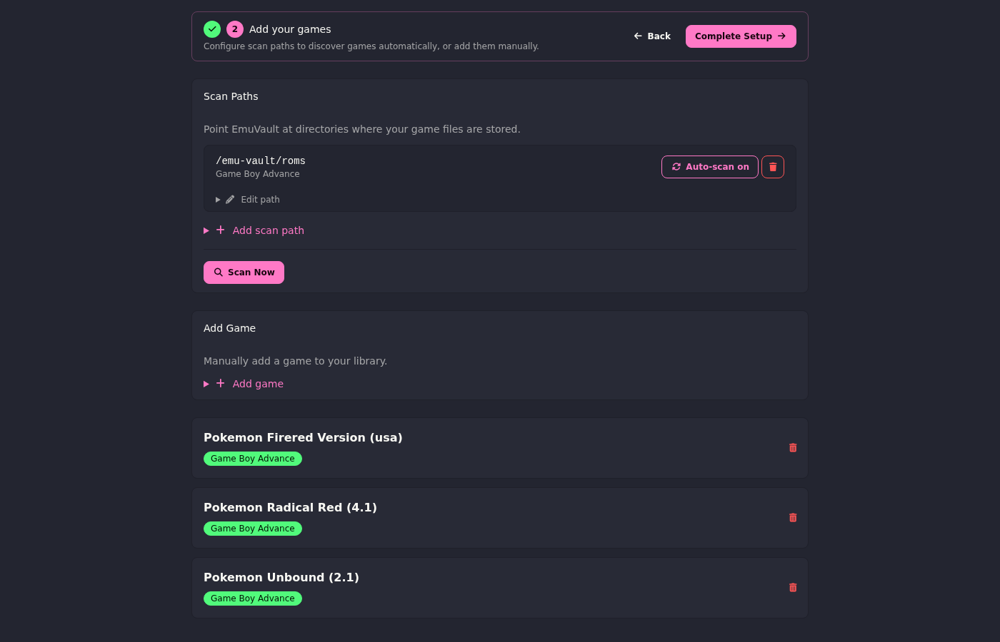

# EmuVault

A self-hosted save file manager for emulators. Upload a save from one device, download it to another with the filename and extension automatically adjusted for the target emulator — no manual renaming required.

Designed to run on your own PC or home server and be accessed from any device via browser. Works great as a PWA on iPhone.

## Screenshots

<details>
<summary>Onboarding</summary>

<table>
  <tr>
    <td></td>
    <td></td>
  </tr>
</table>

</details>

<details>
<summary>Desktop</summary>

<table>
  <tr>
    <td></td>
    <td></td>
  </tr>
  <tr>
    <td></td>
    <td></td>
  </tr>
  <tr>
    <td></td>
    <td></td>
  </tr>
</table>

</details>

<details>
<summary>Mobile</summary>

<table>
  <tr>
    <td></td>
    <td></td>
    <td></td>
    <td></td>
  </tr>
</table>

</details>

---

## Contents

- [Screenshots](#screenshots)
- [Features](#features)
- [Supported emulators](#supported-emulators-built-in-profiles)
- [Requirements](#requirements)
- [Quick start](#quick-start)
- [Accessing from other devices](#accessing-from-other-devices)
- [Deploying to a NAS or home server](#deploying-to-a-nas-or-home-server)
  - [TrueNAS Scale](#truenas-scale)
  - [SSL](#ssl)
  - [Updating](#updating)
- [Installing as a home screen app](#installing-as-a-home-screen-app-iphone)
- [Push notifications](#push-notifications)
- [Monitoring](#monitoring)
- [Configuration](#configuration)
- [First-run onboarding](#first-run-onboarding)
- [Usage](#usage)
  - [Adding a game](#adding-a-game)
  - [Uploading a save](#uploading-a-save)
  - [Configuring emulator filenames](#configuring-emulator-filenames)
  - [Downloading a save](#downloading-a-save)
  - [Emulator profiles](#emulator-profiles)
  - [Library scan](#library-scan)
  - [Export and Import](#export-and-import)
  - [Activity log](#activity-log)
- [Tech stack](#tech-stack)
- [Contributing](#contributing)

---

## Features

- **Save sync** — upload a save file from any device, download it to any other
- **Automatic filename handling** — configure per-game filenames per emulator; downloads are renamed to match what each emulator expects (e.g. `Pokemon - Emerald Version.srm` for RetroArch, `Pokemon_Emerald.sav` for Delta)
- **Save history** — every upload is versioned with a version number; previous saves are kept and can be re-downloaded from the game show page
- **Save path hints** — shows the exact path to place the downloaded file based on your emulator's configured save directory
- **Cover images** — upload a cover image for each game with automatic 3:4 cropping. Displayed on game cards and the game show page
- **Card and list views** — toggle between a card grid (with cover images) and a compact list view on the games page. Preference is persisted server-side
- **Infinite scroll** — games load automatically as you scroll down, no manual pagination
- **Now Playing banner** — the currently playing game is highlighted at the top of the games page with quick access to view and clear
- **Library scan** — point EmuVault at your ROM/save directories and it discovers games automatically, grouped by system. Scan results appear in a review modal where you choose which to import. Games appear in real-time via ActionCable as they're imported
- **Auto-scan** — scheduled scans run in the background (hourly, every 6 hours, or daily). When new games are found, a notification is sent and the review modal auto-opens on your next visit to the games page
- **Multi-emulator support** — ships with profiles for RetroArch, Delta, mGBA, Dolphin, PPSSPP, melonDS, Snes9x, OpenEmu, DuckStation and more (28 profiles across Linux, Windows, macOS, iOS, Android)
- **Export / Import** — export your entire library (games, saves, emulator configs) as a ZIP archive; restore from a previous export with per-game conflict resolution (keep existing or replace)
- **Quick Sync** — set a game as "Now Playing" for one-tap upload and download from the mobile nav
- **Activity log** — every upload and download is recorded with timestamp, device type (inferred from user agent), and IP address. Paginated with automatic cleanup of old entries
- **Themes** — 22 selectable themes (dark and light), applied instantly with live preview
- **First-run onboarding** — guided 2-step setup: choose your emulators from the built-in library → add games (scan or manual). Dedicated onboarding layout with step progress indicator
- **Notifications** — in-app notification panel with live badge updates via ActionCable; web push to iPhone (when installed as a home screen app) via the Web Push API. Notifies on new save uploads and auto-scan discoveries
- **Mobile-first UI** — works on iPhone with safe-area insets, installable as a home screen app (PWA). Bottom sheet modals on mobile
- **Multi-language** — supports English, French, German, Spanish, and Italian. Set the `DEFAULT_LOCALE` env var to change the app language
- **Single-user** — self-hosted, no accounts or cloud services

## Supported emulators (built-in profiles)

| Emulator | Platforms | Extensions |
|---|---|---|
| RetroArch | Linux, Windows, macOS, Android | `.srm`, `.sav`, `.sra`, `.gci`, `.bin` |
| Delta | iOS | `.sav`, `.srm`, `.dsv` |
| mGBA | Linux, Windows, macOS, Android | `.sav` |
| Dolphin | Linux, Windows, macOS | `.gci`, `.bin` |
| PPSSPP | Linux, Windows, macOS, iOS, Android | `.bin` |
| melonDS | Linux, Windows, macOS | `.sav` |
| Snes9x | Linux, Windows, macOS | `.srm` |
| OpenEmu | macOS | `.sav`, `.srm`, `.dsv`, `.mcr`, `.gci` |
| DuckStation | Linux, Windows, macOS, Android | `.mcd` |
| PCSX2 | Linux, Windows, macOS | `.ps2` |

---

## Requirements

- Docker and Docker Compose

That's it. Everything else runs in containers.

## Quick start

```bash
git clone <repo-url> emu-vault
cd emu-vault
./scripts/install.sh
docker compose up
```

`install.sh` handles first-time setup: generates a `.env` file with secure random credentials, generates VAPID keys for push notifications, builds containers, creates the database, runs migrations, and seeds emulator profiles.

The app runs at **http://localhost:3000**.

On subsequent runs, just:

```bash
docker compose up
```

## Accessing from other devices

The app binds to `0.0.0.0:3000`, so it's reachable from any device on your local network at `http://<your-machine-ip>:3000`.

For remote access (e.g. from your phone when away from home), a reverse proxy or [Tailscale](https://tailscale.com) works well.

## Deploying to a NAS or home server

EmuVault is available as a Docker image on Docker Hub: `rturner1989/emuvault`

This is the recommended way to run EmuVault in production — pull the pre-built image and deploy it alongside PostgreSQL and Redis using the provided compose file.

### 1. Generate secrets

```bash
# Generate a SECRET_KEY_BASE
docker run --rm rturner1989/emuvault:latest bundle exec rails secret

# Generate VAPID keys for push notifications
docker run --rm rturner1989/emuvault:latest bundle exec rails runner "puts WebPush.generate_key.to_hash"
```

### 2. Create persistent directories

Create directories on your NAS for data persistence:

```
/path/to/emuvault/postgres   # database
/path/to/emuvault/redis      # job queue
/path/to/emuvault/storage    # save files (Active Storage — EmuVault's internal store)
```

If you want to use the **library scan** feature, you'll also need your emulator saves directory accessible on the host (e.g. a TrueNAS dataset at `/mnt/tank/saves`). See the [Library Scan](#library-scan) section below.

### 3. Deploy with Docker Compose

Copy `docker-compose.prod.yml` from this repo and replace the placeholder values:

- `YOUR_SECRET_KEY_BASE` — from step 1
- `YOUR_DB_PASSWORD` — choose a strong password
- `YOUR_VAPID_PUBLIC_KEY` / `YOUR_VAPID_PRIVATE_KEY` — from step 1
- `/path/to/...` — your persistent directory paths from step 2

Then start it:

```bash
docker compose -f docker-compose.prod.yml up -d
```

The app will create the database, run migrations, seed emulator profiles, and start. Access it at `http://<server-ip>:3000`.

### TrueNAS Scale

1. Go to **Apps > Discover Apps > Custom App**
2. Name: `emuvault`
3. Paste the contents of `docker-compose.prod.yml` with your values filled in
4. Save and deploy

### SSL

SSL is off by default. If you access EmuVault over [Tailscale](https://tailscale.com), traffic is already encrypted end-to-end — no reverse proxy needed.

To enable SSL (e.g. behind nginx or Caddy), add `FORCE_SSL: "true"` to the app and sidekiq environment variables.

### Updating

New versions are published to Docker Hub with a version tag (e.g. `rturner1989/emuvault:1.2.0`) and as `:latest`.

**Docker Compose:**
```bash
docker compose -f docker-compose.prod.yml pull
docker compose -f docker-compose.prod.yml up -d
```

**TrueNAS Scale:** TrueNAS does not re-pull `:latest` on restart. To update, edit the app in the TrueNAS UI and change the image tag to the new version (e.g. `1.0.3` → `1.1.0`). TrueNAS will pull the new image and restart automatically.

The app runs `rails db:prepare` on startup so any pending migrations are applied automatically.

---

## Installing as a home screen app (iPhone)

1. Open the app in Safari
2. Tap the Share button → **Add to Home Screen**
3. The app launches full-screen with proper safe-area handling

## Push notifications

EmuVault sends a notification whenever a save is uploaded. Notifications appear in the bell icon panel in the nav. If you've installed EmuVault as a home screen app on iPhone (iOS 16.4+), you can also receive native push notifications.

To enable push notifications on a device:

1. Open **Settings** in EmuVault
2. Tap **Enable push notifications** and grant permission when prompted

VAPID keys are generated automatically during `install.sh`. If you need to regenerate them:

```bash
./scripts/generate_vapid_keys
```

Copy the output into your `.env`, then restart:

```bash
docker compose restart app sidekiq
```

## Monitoring

EmuVault includes built-in admin dashboards.

| Dashboard | URL | Description |
|---|---|---|
| **PgHero** | `/pghero` | Database performance — slow queries, index usage, table sizes |
| **Sidekiq** | `/sidekiq` | Background job queues, failures, and throughput |

### Uptime monitoring with Uptime Kuma

[Uptime Kuma](https://github.com/louislam/uptime-kuma) is recommended for uptime monitoring. Run it as a separate app on your server (not bundled with EmuVault, so it keeps watching even if EmuVault has an issue).

```bash
docker run -d --restart=unless-stopped -p 3001:3001 \
  -v /path/to/uptime-kuma:/app/data \
  --name uptime-kuma louislam/uptime-kuma:1
```

Then add a monitor in Uptime Kuma pointing at `http://<server-ip>:3000/up`. No Docker socket access is required.

## Configuration

All configuration is via environment variables. Key variables:

| Variable | Description | Default |
|---|---|---|
| `DB_HOST` | PostgreSQL host | `postgres` |
| `DB_USERNAME` | PostgreSQL username | — |
| `DB_PASSWORD` | PostgreSQL password | — |
| `DB_NAME` | Database name | — |
| `REDIS_URL` | Redis URL | `redis://redis:6379/0` |
| `VAPID_PUBLIC_KEY` | Web push public key | — |
| `VAPID_PRIVATE_KEY` | Web push private key | — |
| `ACTIVITY_RETENTION_DAYS` | Days to retain activity log entries | `90` |
| `DEFAULT_LOCALE` | App language (`en`, `fr`, `de`, `es`, `it`) | `en` |
| `FORCE_SSL` | Enable SSL redirect | `false` |

See `.env.example` for the full list.

## First-run onboarding

On first login you'll be walked through a 2-step onboarding flow in a dedicated layout:

1. **Select emulators** — choose which emulators you use from the built-in library (28 profiles across 10 emulators). You can also create custom profiles. Systems with games in your library are locked.
2. **Add games** — configure scan paths to discover games automatically, or add them manually. Games imported via scan appear in real-time. Click "Complete Setup" when ready.

After completing setup you'll be taken to the games page.

## Usage

### Adding a game

From the Games page, click **Add Game** and enter the title and system.

### Uploading a save

On a game's page, use the **Upload** form. Optionally select which emulator the save came from (used for display and as a source hint). The file is stored as-is; the checksum is recorded for reference.

### Configuring emulator filenames

On a game's page, the **Emulator Save Filenames** section lets you set the exact filename (without extension) each emulator uses for this game's save file. This is usually the ROM filename without extension (e.g. `Pokemon - Emerald Version` for RetroArch).

If left blank, the app generates a filename from the game title.

### Downloading a save

On the game's page, select the emulator you're downloading for from the dropdown. The file will be downloaded with the correct name and extension. If you've configured a save directory for that emulator, the exact path to place the file is shown.

### Emulator profiles

Manage your active emulators at `/emulator_profiles`. You can add from the built-in library, create custom profiles, or edit save paths. Built-in profiles can be deactivated but not deleted.

Each profile has a **game system** field (required for library scanning) and a **save directory** field (used for save path hints and library scanning).

### Library scan

EmuVault can automatically discover and import save files from your emulator directories — similar to how Plex imports media from a library folder.

**Setup:**

1. **Make the directory accessible to EmuVault:**
   - **NAS / Docker:** mount the directory as a volume in `docker-compose.prod.yml` for both `app` and `sidekiq`:
     ```yaml
     volumes:
       - /path/to/storage:/emu-vault/storage
       - /mnt/tank/saves:/saves:ro   # ← your saves dataset
     ```
     The `:ro` flag makes it read-only — EmuVault only reads files during scanning.
   - **Local install (PC/Mac):** no mounting needed — use the full local path directly (e.g. `/home/user/games/gba/` or `/Users/robert/RetroArch/saves/`).

2. **Configure each emulator profile** — go to **Emulator Profiles** and for each profile set:
   - **Game system** — which console (e.g. Game Boy Advance)
   - **Save directory** — the path *inside the container* to that emulator's saves (e.g. `/saves/retroarch/gba/`)

   EmuVault matches files to profiles by directory prefix, so each profile should point to a specific system subdirectory — the same way Plex uses separate folders for Movies and TV Shows.

3. **Scan** — on the **Games** page, click **Scan Library**. A review modal opens showing discovered games grouped by system. Deselect anything you don't want, then click **Add to library**. Games appear in real-time as they're imported via ActionCable broadcasts.

**Auto-scan:**

Turn on **Auto-scan** in Settings to have EmuVault check for new games automatically. Choose an interval (hourly, every 6 hours, or daily). When new games are found, a notification is sent. On your next visit to the Games page, the review modal auto-opens with the discovered games for your approval — nothing is imported without review.

> **Note:** Games already in EmuVault (matched by title and system) are always skipped, so re-scanning is safe.

### Export and Import

Go to **Settings → Data** to back up your library or restore from a previous backup.

- **Export** — downloads a ZIP archive containing all games, save files, and emulator filename configs
- **Import** — upload a previously exported ZIP; a review page shows what will be added and flags any conflicts (games that already exist), letting you choose to skip or replace each one

### Activity log

The `/activity` page shows a full history of all uploads and downloads, including timestamp, game, device type, and IP address. Entries older than `ACTIVITY_RETENTION_DAYS` are pruned automatically each night.

---

## Tech stack

- **Ruby on Rails 8.1** + PostgreSQL 17
- **Hotwire** (Turbo + Stimulus) for reactive UI — Turbo Frames, Turbo Streams, ActionCable broadcasts
- **Tailwind CSS v4** + **DaisyUI 5** for styling and theming (22 selectable themes)
- **HAML** templates, **ViewComponent** for UI components, **SimpleForm** for forms
- **Active Storage** for save file storage
- **Sidekiq** + Redis for background jobs and scheduled scans
- **Pagy** for infinite scroll pagination
- **Cropper.js** for cover image cropping
- **Noticed** for in-app notifications + web push
- **a11y-dialog** for accessible modals
- **RSpec** + Capybara + Playwright for testing (547 specs)
- **i18n** — 5 locales (en, fr, de, es, it) with automated translation via Claude CLI
- **Docker** for development and deployment

## Contributing

EmuVault is a personal project and not accepting external contributions. If you run into a problem or have a feature idea, feel free to open an issue.
